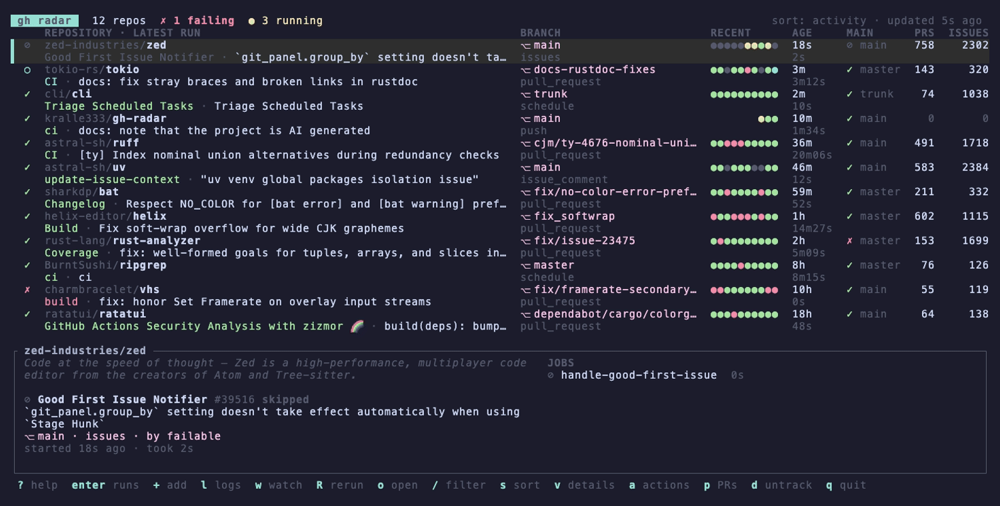

# gh radar

> [!WARNING]
> This project is AI generated using [Claude](https://claude.ai). Use at your own risk.

A [`gh`](https://cli.github.com) extension that shows all the repos you're
juggling in one terminal dashboard: the latest workflow run for each repo,
whether the default branch is green, and the open PR and issue counts. From
there you can jump straight to logs, watch a run live, re-run failed jobs or
open the right page in the browser.



Each repo takes two lines: the name, then its latest run. **RECENT** shows the
last 10 run results, newest on the right. The details pane at the bottom (or
on the right on very wide terminals) shows the selected repo's run in full and
its jobs. Failed jobs come first, each with the step that failed. Toggle the
pane with `v`.

It talks to GitHub through `gh api`, so it uses your existing `gh auth login`
and needs no extra tokens.

## Install

Requires the [GitHub CLI](https://cli.github.com), logged in with `gh auth login`.

```sh
gh extension install kralle333/gh-radar
```

Prebuilt binaries are published for macOS (Apple Silicon and Intel), Linux
(x86_64 and arm64, statically linked) and Windows (x86_64). On other platforms
`gh` clones the repo instead, and the first run builds it with `cargo`, so you
need a [Rust toolchain](https://rustup.rs) there.

```sh
gh extension upgrade radar     # update to the latest release
gh extension remove radar      # uninstall
```

### From source

```sh
git clone https://github.com/kralle333/gh-radar && cd gh-radar
cargo build --release
gh extension install .
```

The local install runs `target/release/gh-radar`, so a new `cargo build --release`
takes effect immediately.

## Usage

The easiest way to choose repos is the interactive picker. Press `+` in the
dashboard, or run `gh radar add -i`. It lists every repo you can access:
your own, ones you collaborate on, and those in your organizations (including
team repos). Type to search, `tab` to narrow it to one owner, `space` to tick
a repo on or off, `ctrl-a` to tick everything shown, and `enter` to save.
Running `gh radar` with nothing tracked opens the picker automatically.

```sh
gh radar add -i                # pick from all repos you have access to
gh radar scan ~/projects       # track every GitHub clone found under a folder (depth 2)
gh radar scan ~/projects --dry-run
gh radar add                   # track the repo in the current directory
gh radar add cli/cli https://github.com/owner/repo
gh radar rm owner/repo
gh radar ls

gh radar                       # open the dashboard
gh radar status                # one-shot summary, no TUI
gh radar status --failing      # only repos whose latest run failed
gh radar status --exit-status  # exit 1 if anything is failing (scripts, prompts)
```

### Dashboard keys

| key         | action                                                    |
|-------------|-----------------------------------------------------------|
| `j`/`k`, ↑/↓ | move                                                     |
| `enter`     | repo list → recent runs; run list → `gh run view` summary |
| `esc`       | back / clear filter / quit                                |
| `o`         | open repo (or the selected run) in the browser            |
| `O`         | open the latest/selected run in the browser               |
| `a` `p` `i` | open the Actions / Pull requests / Issues page            |
| `l`         | logs in a pager (only failed jobs if the run failed)      |
| `w`         | watch a run live (`gh run watch`)                         |
| `R`         | re-run the run (only failed jobs if it failed), with confirmation |
| `C`         | cancel an in-progress run, with confirmation              |
| `/`         | filter repos by name                                      |
| `+`         | add/remove repos with the picker                          |
| `d`         | stop tracking the selected repo, with confirmation        |
| `s`         | cycle sort: activity → attention (failing first) → name   |
| `v`         | show/hide the details pane                                |
| `r`         | refresh now                                               |
| `?`         | help                                                      |

On the repo list, run actions (`l`, `w`, `R`, `C`, `O`) apply to that repo's
latest run.

The **MAIN** column shows the latest run on the repo's default branch, so a
failing PR build doesn't hide that `main` is green, and the reverse.

### Refreshing and notifications

All repos refresh every `refresh_secs`. Repos with a queued or running workflow
refresh every `active_refresh_secs`. When a run that was in progress finishes,
the footer shows the result. A failure also rings the terminal bell, and if
`desktop_notifications` is on you get a macOS notification (or `notify-send`
on Linux).

## Config

`gh radar config` prints the path, which defaults to
`~/.config/gh-radar/config.toml` and can be overridden with `GH_RADAR_CONFIG`.

```toml
refresh_secs = 120
active_refresh_secs = 15
desktop_notifications = true
# Workflow paths to hide. A trailing * matches a prefix. The default hides
# GitHub-managed runs (Dependabot update jobs, Copilot code reviews). You can't
# re-run those, and they would otherwise mask the repo's real CI status.
# Use ["dynamic/agents/*"] to keep Dependabot jobs visible.
ignore_workflows = ["dynamic/*"]
repos = ["owner/repo", "owner/other"]
```

Logs open in `$GH_RADAR_PAGER`, then `$PAGER`, falling back to `less -R +G`,
which opens at the end of the log where errors usually are (`more` on Windows).

Each refresh makes one REST call per repo plus a single GraphQL call for all
of them, so about 60 repos at the default interval stays well within GitHub's
rate limit.

## Recording the demo

`demo/demo.gif` is recorded with [VHS](https://github.com/charmbracelet/vhs)
from `demo/demo.tape`:

```sh
cargo build --release && vhs demo/demo.tape
```

The tape sets `GH_RADAR_DEMO=1`, which makes gh radar use fictional accounts
and repos (`alex-dev`, `octo-labs`, `acme-corp`) instead of calling GitHub. That
way the recording never shows real repositories, and it never writes to your
config.

## Releasing

Bump `version` in `Cargo.toml`, commit, then tag and push:

```sh
git tag v0.2.0 && git push origin v0.2.0
```

The `release` workflow builds every platform and publishes a GitHub release
with the binaries named the way `gh extension install` expects. It refuses to
run if the tag doesn't match the version in `Cargo.toml`.

## License

MIT
